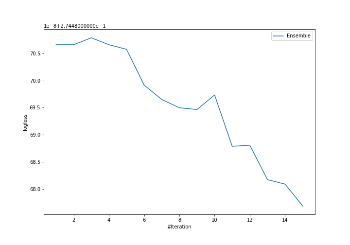
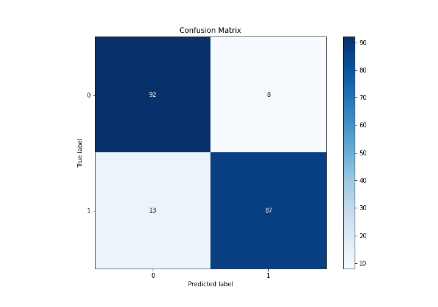
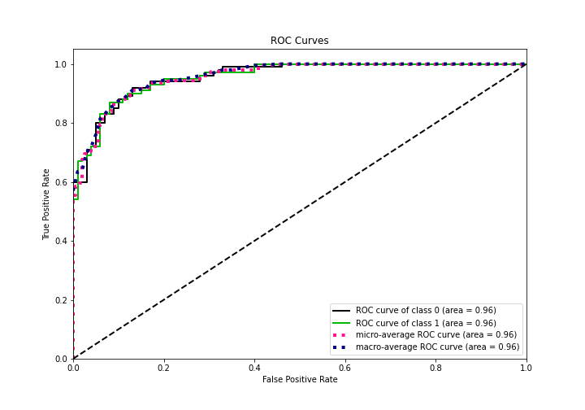
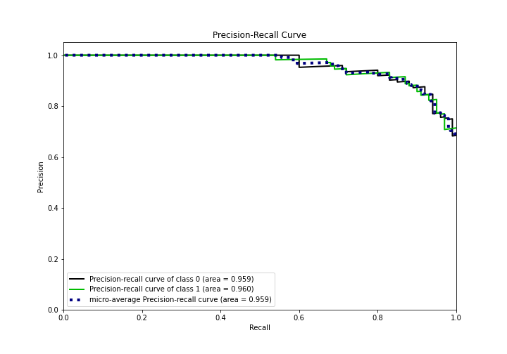
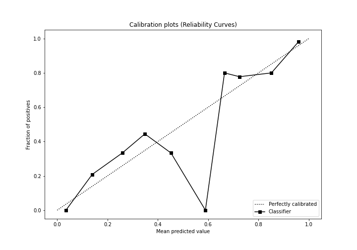
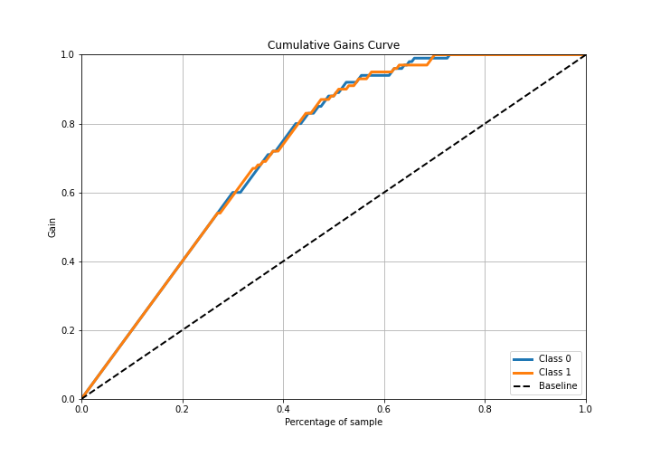
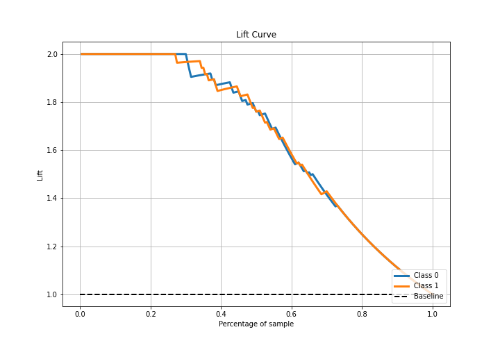

# Summary of Ensemble

[<< Go back](../README.md)

## Ensemble structure
| Model                                     |   Weight |
|:------------------------------------------|---------:|
| 6_Xgboost_GoldenFeatures_SelectedFeatures |       15 |

## Metric details
|           |    score |    threshold |
|:----------|---------:|-------------:|
| logloss   | 0.274481 | nan          |
| auc       | 0.9571   | nan          |
| f1        | 0.892308 |   0.631021   |
| accuracy  | 0.895    |   0.631021   |
| precision | 1        |   0.942777   |
| recall    | 1        |   0.00713377 |
| mcc       | 0.790989 |   0.631021   |

## Confusion matrix (at threshold=0.631021)
|              |   Predicted as 0 |   Predicted as 1 |
|:-------------|-----------------:|-----------------:|
| Labeled as 0 |               92 |                8 |
| Labeled as 1 |               13 |               87 |

## Learning curves

## Confusion Matrix

## Normalized Confusion Matrix

## ROC Curve

## Kolmogorov-Smirnov Statistic

## Precision-Recall Curve

## Calibration Curve

## Cumulative Gains Curve

## Lift Curve

[<< Go back](../README.md)
