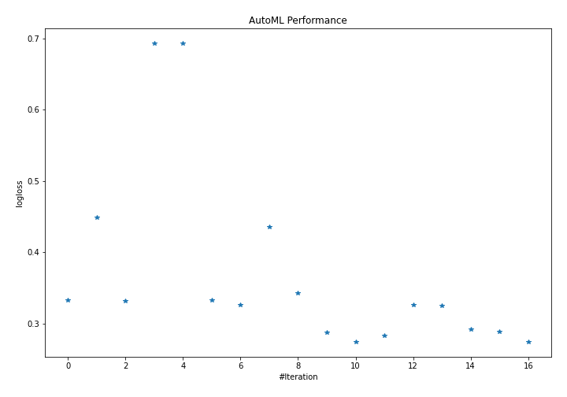
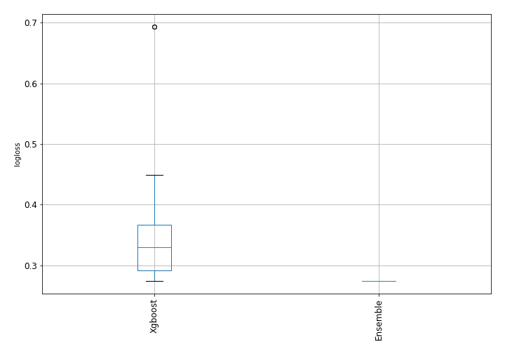
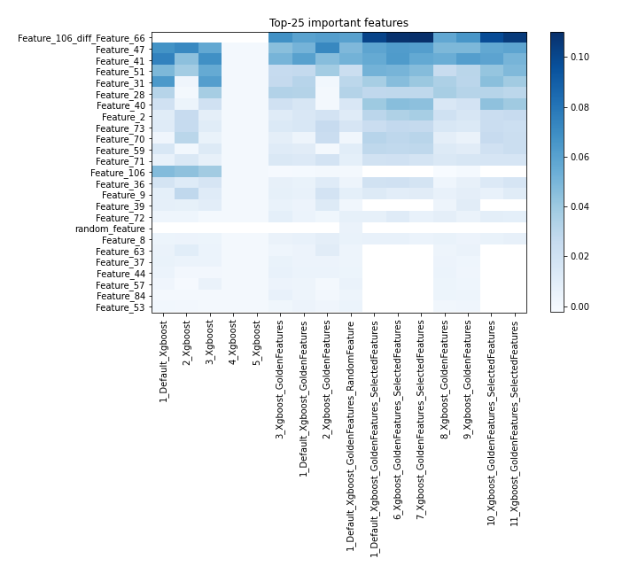
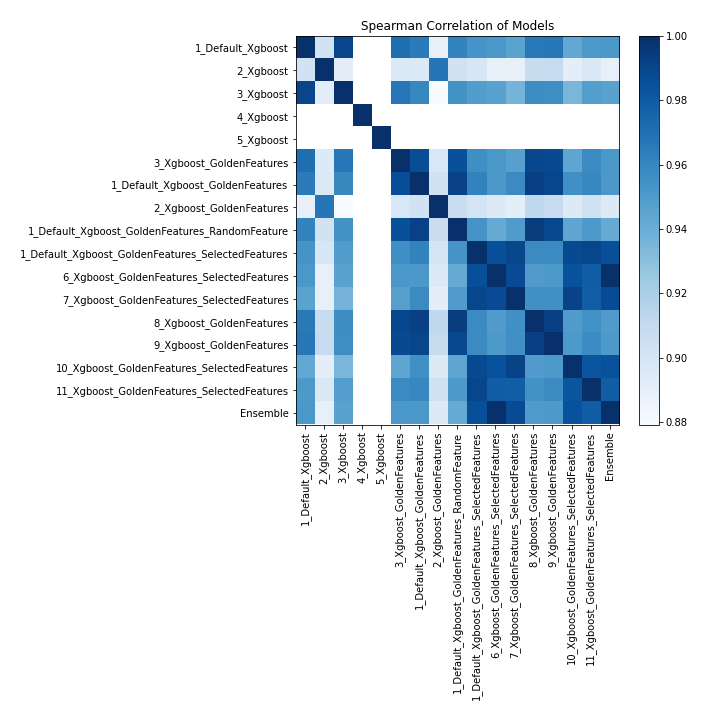

# AutoML Leaderboard

| Best model   | name                                                                                                             | model_type   | metric_type   |   metric_value |   train_time |   single_prediction_time |
|:-------------|:-----------------------------------------------------------------------------------------------------------------|:-------------|:--------------|---------------:|-------------:|-------------------------:|
|              | [1_Default_Xgboost](1_Default_Xgboost/README.md)                                                                 | Xgboost      | logloss       |       0.332851 |        27.73 |                   0.204  |
|              | [2_Xgboost](2_Xgboost/README.md)                                                                                 | Xgboost      | logloss       |       0.448854 |        45.28 |                   0.402  |
|              | [3_Xgboost](3_Xgboost/README.md)                                                                                 | Xgboost      | logloss       |       0.331957 |        40.14 |                   0.492  |
|              | [4_Xgboost](4_Xgboost/README.md)                                                                                 | Xgboost      | logloss       |       0.693147 |        27.88 |                   0.38   |
|              | [5_Xgboost](5_Xgboost/README.md)                                                                                 | Xgboost      | logloss       |       0.693147 |        26.07 |                   0.3231 |
|              | [3_Xgboost_GoldenFeatures](3_Xgboost_GoldenFeatures/README.md)                                                   | Xgboost      | logloss       |       0.332928 |        69.73 |                   0.3525 |
|              | [1_Default_Xgboost_GoldenFeatures](1_Default_Xgboost_GoldenFeatures/README.md)                                   | Xgboost      | logloss       |       0.326989 |        31.11 |                   0.3199 |
|              | [2_Xgboost_GoldenFeatures](2_Xgboost_GoldenFeatures/README.md)                                                   | Xgboost      | logloss       |       0.436148 |        23.26 |                   0.3264 |
|              | [1_Default_Xgboost_GoldenFeatures_RandomFeature](1_Default_Xgboost_GoldenFeatures_RandomFeature/README.md)       | Xgboost      | logloss       |       0.343393 |        22.45 |                   0.3088 |
|              | [1_Default_Xgboost_GoldenFeatures_SelectedFeatures](1_Default_Xgboost_GoldenFeatures_SelectedFeatures/README.md) | Xgboost      | logloss       |       0.287954 |        11.01 |                   0.2039 |
| **the best** | [6_Xgboost_GoldenFeatures_SelectedFeatures](6_Xgboost_GoldenFeatures_SelectedFeatures/README.md)                 | Xgboost      | logloss       |       0.274481 |        11.62 |                   0.2049 |
|              | [7_Xgboost_GoldenFeatures_SelectedFeatures](7_Xgboost_GoldenFeatures_SelectedFeatures/README.md)                 | Xgboost      | logloss       |       0.28382  |        15.51 |                   0.3118 |
|              | [8_Xgboost_GoldenFeatures](8_Xgboost_GoldenFeatures/README.md)                                                   | Xgboost      | logloss       |       0.326846 |        36.67 |                   0.3615 |
|              | [9_Xgboost_GoldenFeatures](9_Xgboost_GoldenFeatures/README.md)                                                   | Xgboost      | logloss       |       0.324927 |        44.92 |                   0.6825 |
|              | [10_Xgboost_GoldenFeatures_SelectedFeatures](10_Xgboost_GoldenFeatures_SelectedFeatures/README.md)               | Xgboost      | logloss       |       0.292463 |        13.34 |                   0.1758 |
|              | [11_Xgboost_GoldenFeatures_SelectedFeatures](11_Xgboost_GoldenFeatures_SelectedFeatures/README.md)               | Xgboost      | logloss       |       0.289011 |        11.28 |                   0.1667 |
|              | [Ensemble](Ensemble/README.md)                                                                                   | Ensemble     | logloss       |       0.274481 |         1.87 |                   0.1828 |

### AutoML Performance

### AutoML Performance Boxplot

### Features Importance

### Spearman Correlation of Models

